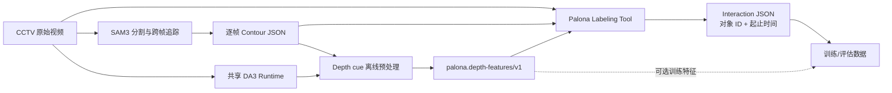
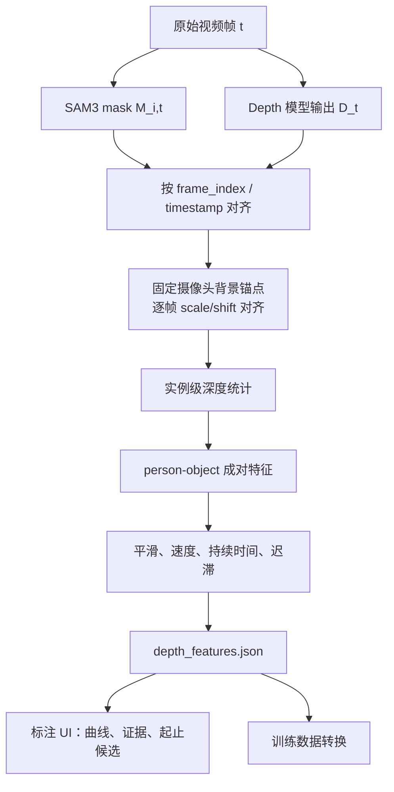

# Palona 视频交互标注与 Depth Prior Pipeline

> 本文档基于 `Palona_Labeling_Tool` 当前工作树（2026-07-19）、同一工作区中的 `vision_pipeline`，以及 2026-07-11 视频交互识别方案会议纪要整理。
>
> 文档会严格区分：**当前已经实现并通过测试的标注/Depth cue 流程**与仍待实验验证的训练方案。当前仓库已经包含 DA3 离线预处理、版本化 sidecar、前端 cue 面板和测试。
>
> **当前样例资产仍是 Git LFS pointer**，运行样例前需要安装 Git LFS 并执行 `git lfs pull`。详见第 8 节。

## 1. 项目目标

Palona 的目标不是只追踪“画面里有什么对象”，而是进一步描述“哪些对象在什么时间发生了什么交互”。例如：

- `occupy_table`：一名或多名顾客占用桌子；
- `table_touch`：员工服务、收取餐具或以其他方式与桌子发生交互；
- 后续可扩展到 `wait_at_cashier_machine`、`operate_cashier_machine`、`applying_soap` 等事件。

当前工作的核心链路是：



一句话概括：**SAM3 提供“对象是谁、每帧在哪里”，标注工具提供“对象之间发生了什么、从何时到何时”，Depth Prior 将补充“对象在相对深度上是否接近、正在靠近还是远离”。**

## 2. 为什么需要这条 Pipeline

会议中总结了两类问题：

1. 直接把 SAM3 mask/track 交给 VLM 判断事件，误检和漏检较多。会议纪要估计部分测试中的假阳性/假阴性约为 60%–70%，典型错误包括把路过人员判断成操作收银机；这个比例仍需通过正式实验复核。
2. 通过固定 bounding box、polygon、持续时间等硬规则可以改善一个场景，但换摄像头或换门店后往往需要重新配置，泛化能力有限。

因此当前路线是：

- 先用少量视频做高质量人工交互标注；
- 用 SAM3 保留对象级时空对应关系；
- 加入 Depth Prior，提供相对空间位置和变化趋势；
- 用人工标注和时空特征完成模型微调；
- 按 `V0 人工标注 → V1 模型自标 → V2 只修边界/极端案例` 逐步降低标注成本。

会议里还明确了一个重要边界：第一阶段优先验证离线效果，**暂不要求实时推理**。

## 3. 当前仓库实际实现状态

| 能力 | 状态 | 说明 |
|---|---:|---|
| 本地选择 MKV/MP4/MOV/WebM | 已实现 | 浏览器通过 `URL.createObjectURL` 直接读取，不上传视频 |
| 加载 SAM3 Contour JSON | 已实现 | 使用 Web Worker 解析大型 JSON，避免阻塞主 UI |
| 视频与逐帧轮廓同步 | 已实现 | 有界时间对齐；超出 Control coverage 后 mask 与点击同时失效 |
| CUDA 整段视频入口 | **已实现** | 复用 `vision_pipeline` whole/split、覆盖验证与 Control 原子提交 |
| Canvas mask/contour 渲染 | 已实现 | track ID 稳定配色，支持 hover 与点选 |
| 按类别和 track ID 显示/隐藏 | 已实现 | 默认加载 JSON 后全选全部 track |
| 创建、编辑交互时间段 | 已实现 | 保存对象 ID、交互类型、开始/结束秒数 |
| 交互覆盖完整性检查 | 已实现 | 保存前检查所选对象在区间内是否缺失 contour，并提醒用户确认 |
| 精确训练 JSON 导出 | **已实现** | 输出严格的 `event/person_id_list/table_id/start_time/end_time` 数组 |
| Interaction 删除 | 已实现 | 删除前二次确认；下一次新建按最小未使用 ID 编号 |
| 项目保存、重开与自动恢复 | **已实现** | `palona.annotation-project/v1` 文件 + 匹配视频/Control 的浏览器本地 autosave |
| ROI 绘制与 blackout preview | **已实现** | normalized polygon、拖动顶点、严格几何校验、ROI 外黑屏 |
| ROI masked video / filtered contour 导出 | **已实现** | Python CLI 流式过滤，原子输出且不覆盖源文件 |
| ID alias/manual merge | **已实现** | 支持增删、传递解析、循环拒绝和 minimal export canonicalization |
| 播放/overlay 辅助 | **已实现** | 逐帧、速度、fill/contour、opacity、ID、类别/实例显示开关及快捷键 |
| DA3 estimated relative depth 预处理 | **已实现** | 顺序抽帧调用 companion DA3 Runtime；client 支持 CUDA/MPS/CPU |
| Depth sidecar 严格校验 | **已实现** | `palona.depth-features/v1`，校验模型语义、视频、Contour、帧和 track 对齐 |
| Depth cue 标注辅助 UI | **已实现** | 实例 depth rank、person–object 证据、趋势、持续时间、可点击起止候选 |
| 交互识别模型训练 | 未实现 | 当前仓库负责数据检查与标注，不负责训练 |

## 4. 代码结构

```text
Palona_Labeling_Tool/
├── app/
│   ├── page.tsx              # 当前核心：文件加载、视频同步、轮廓 UI、交互标注与导出
│   ├── components/
│   │   └── DepthEvidencePanel.tsx
│   ├── lib/
│   │   ├── depth-features.ts # sidecar 类型、严格解析和按时间对齐
│   │   └── labeling-project.ts
│   │                         # 项目、ROI、alias 与 minimal export 的纯数据层
│   ├── globals.css           # 标注界面样式
│   ├── layout.tsx            # Next.js 根布局和页面 metadata
│   └── chatgpt-auth.ts       # ChatGPT Hosting 认证辅助；当前标注页未调用
├── assets/chica/table/       # Git LFS 管理的样例视频、Contour JSON 和交互示例
├── db/
│   ├── index.ts              # Cloudflare D1/Drizzle 初始化辅助
│   └── schema.ts             # 当前为空；标注数据尚未写入数据库
├── worker/index.ts           # Cloudflare/Vinext Worker 入口
├── depth_pipeline/
│   ├── src/palona_depth/     # Depth 与 ROI export 的 adapter / feature / CLI
│   ├── tests/                # 合成数据、迟滞与端到端测试
│   ├── pyproject.toml
│   └── uv.lock
├── docs/
│   ├── depth-features.schema.json
│   └── annotation-project.schema.json
├── examples/synthetic-project.json
├── scripts/
│   ├── depth-preprocess.sh
│   ├── full-video-preprocess.sh
│   ├── control-merge.sh
│   ├── roi-export.sh
│   ├── video-convert.sh
│   └── depth-test.sh
├── tests/
│   ├── rendered-html.test.mjs
│   └── labeling-project.test.mjs
├── .openai/hosting.json      # Hosting binding；当前 D1/R2 均为 null
├── package.json              # Next 16 + React 19 + Vinext/Vite/Cloudflare 工具链
└── README.md
```

需要特别区分两种 “Worker”：

- `app/page.tsx` 动态创建的 **Web Worker**：只在浏览器中解析大型 contour JSON；
- `worker/index.ts` 的 **Cloudflare Worker**：负责部署环境中的 HTTP 请求和图片优化。

运行时状态保存在 React 内存中；完成视频与 Control 加载后，保存过的 interactions、ROI 和 alias 会以小型项目 JSON 防抖写入浏览器 `localStorage`。手动 **Save project** 会再下载可移动的项目文件。原视频和大 Contour 不会被复制进项目文件。`db/` 和认证模块属于部署脚手架，并没有进入本地标注主流程。

## 5. 上游：从 CCTV 视频生成 SAM3 Contour JSON

上游代码位于当前工作区的兄弟目录 `../vision_pipeline`，不在本 Git 仓库中。正式整段视频应使用本仓库的安全包装入口；它调用上游 native whole-video session、分块运行、检查首尾覆盖与轮廓坐标，并且只有验证通过后才原子提交最终 Control JSON：

```bash
export VISION_PIPELINE_ROOT=/absolute/path/to/vision_pipeline
export VISION_PIPELINE_PYTHON="$VISION_PIPELINE_ROOT/.venv/bin/python"

./scripts/full-video-preprocess.sh \
  --video /absolute/private/input.mkv \
  --control /absolute/private/run/input.control.json \
  --output-dir /absolute/private/run/sam3-full \
  --prompt person \
  --prompt "cashier machine" \
  --require-label person \
  --split-seconds 12 \
  --overlap-seconds 2
```

正式运行不接受也不会传入 `--max-frames`。显存不足时可改为 `--split-seconds 6 --overlap-seconds 1`。此前 `ai-models sam3 video --max-frames 8` 只属于 Mac/环境 smoke test，不是整段 Control 生成方式；其 8 帧输出播放到末尾后不会被前端继续外推。

黄老师 Linux/CUDA 机器的完整安装、命令和验收步骤见 [`docs/DEPLOYMENT_HUANGHAI.zh-CN.md`](docs/DEPLOYMENT_HUANGHAI.zh-CN.md)。

### 5.1 SAM3 阶段做了什么

1. 读取完整视频和真实 FPS；
2. 用文本 prompt（如 `person`、`table`）运行 SAM3；
3. 为每个实例生成 mask、bbox、类别、置信度和 track ID；
4. 将 mask 外轮廓简化为绝对像素坐标 `contours_xy`；
5. 长视频可切成 12 秒窗口，并保留 2 秒重叠；
6. 相邻窗口在重叠帧中按类别和 bbox IoU 匹配，把局部 ID 映射为全局 ID；
7. 输出供标注工具读取的 JSON；需要人工 QA 时可另外开启轮廓视频输出，推荐 wrapper 默认不生成该视频以节省时间和磁盘。

当使用多个 prompt 时，ID 通常带 prompt namespace，例如：

- `p0:9`：第 0 个 prompt（通常是 `person`）的实例；
- `p1:0`：第 1 个 prompt（通常是 `table`）的实例。

该前缀是工程命名空间，不等于人的角色或对象语义。跨窗口匹配也不能保证绝对正确，所以后续仍需处理 ID switch。

### 5.2 Contour JSON 数据契约

上游完整 JSON 大致如下：

```json
{
  "input_type": "video",
  "video": "path/to/input.mkv",
  "model": "sam3",
  "video_mode": "whole",
  "frames": [
    {
      "frame_index": 0,
      "timestamp_seconds": 0.0,
      "tracks": [
        {
          "track_id": "p0:9",
          "label": "person",
          "confidence": 0.97,
          "state": "active",
          "bbox_xyxy": [100, 80, 320, 700],
          "contours_xy": [[[100, 80], [310, 90], [320, 700]]],
          "contours_format": "absolute_xy",
          "metadata": {}
        }
      ]
    }
  ]
}
```

当前前端实际只保留以下字段：

- 根级：`video`、`frames`；
- 帧级：`frame_index`、`timestamp_seconds`；
- track 级：`track_id`、`label`、`confidence`、`contours_xy`；
- 兼容回退：若顶层没有 `contours_xy`，会尝试读取 `metadata.contours_xy`。

前端和 Depth 预处理也兼容共享 `AI_Runtime` 的 SAM3 manifest：帧内可以使用 `instances`，实例 ID 可以是 `instance_id`，轮廓可以是 `contours`，分数可以是 `score`。两种输入都会被规范化成同一套 `tracks / track_id / contours_xy` 内部结构。

`bbox_xyxy`、`state` 和其余非必要 metadata 目前不会进入前端状态。浏览器、Depth 和 ROI export 都会先把 `tracks` 或 Runtime `instances` 规范化为 `frame_index / timestamp_seconds / track_id / label / confidence / contours_xy`；Depth 和项目数据分别使用独立的版本化 schema。

### 5.3 合并共享 Runtime 的单 prompt manifest

共享 `ai-models` 的 SAM3 video 命令一次处理一个 prompt。分别生成 `person` 和 `table` manifest 后，用严格合并器产生一个可供 UI、Depth 和 ROI CLI 共同消费的 Control JSON：

```bash
./scripts/control-merge.sh \
  --source person=/absolute/private/person/manifest.json \
  --source table=/absolute/private/table/manifest.json \
  --output /absolute/private/clip.control.json
```

`--source` 的顺序就是 namespace 顺序：第一个 prompt 的原始 ID `7` 输出为 `p0:7`，第二个输出为 `p1:7`。CLI 会逐项验证两个 manifest 的 `input_path`、模型名称/revision、宽高、source/sample FPS、帧数以及每帧 `source_frame_index / timestamp_seconds` 完全一致，再保留 confidence、bbox 和 contours 写成 normalized `tracks`。任一不一致都会报错；输出使用同目录临时文件和原子替换，永不覆盖输入 manifest。输出位于 Git worktree 内时必须以 `.control.json` 结尾，并由 `.gitignore` 保护。

## 6. 当前标注工具的工作原理

### 6.1 本地文件与隐私

用户通过浏览器文件选择器打开视频和 JSON。视频被转换为本地 blob URL；JSON 在浏览器 Web Worker 中解析。当前代码没有把视频、轮廓或交互标注发送到远端。

### 6.2 视频—Contour 同步

视频播放时，页面优先使用 `requestVideoFrameCallback` 获取当前 `video.currentTime`。随后 `findAlignedControlFrame()` 在按时间排序的 annotation frames 中二分查找最近帧，并检查该帧是否仍在允许的 cue age 内。

```text
video.currentTime
       │
       ▼
findAlignedControlFrame(frames, time)
       │ 二分查找 + sample/source FPS 最大年龄约束
       ▼
   currentFrame 或 null
       │
       ▼
Canvas 绘制 contours_xy；null 时清空 overlay
```

前端优先读取 SAM3 manifest 的 `media.source_fps` 和 `media.sample_fps`；缺少 sample FPS 时从 annotation timestamp 的中位间隔推断。最大 cue age 为“半个采样周期 + 源帧对齐容差”。超过最后一个 Control sample 或遇到大时间缺口时，`currentFrame` 变为 `null`，旧 mask、hover 和点击区域一起清除。共享 Runtime 同时提供 `frame_index`（抽样序号）和 `source_frame_index`（原视频帧号）时，adapter 使用后者。逐帧前进/后退令视频时间增加或减少 `1 / fps`。

这段逻辑有三个前提：frames 已按时间升序排列、annotation timestamp 与原视频同一时间基准、contour 使用原视频同分辨率的绝对坐标。Control Web Worker 会排序并检查基本帧字段；完整视频 CLI 还会验证首尾覆盖、FPS 时间对应、必需 label 和轮廓边界；Depth sidecar 会继续严格校验帧、track、视频 basename、分辨率和时长。

### 6.3 轮廓渲染与点击

- 同一个 `track_id` 经过字符串 hash 后始终使用同一种颜色；
- Canvas 按原视频像素坐标绘制多边形；
- hover 时使用 point-in-polygon 判断鼠标是否落在 contour 内；
- 多个 contour 重叠时，优先选择面积最小者；
- 点击 contour 会切换该 track 是否作为 interaction participant；
- `visibleTrackIds` 只控制 overlay 可见性；
- `interactionTrackIds` 只控制新建/编辑事件所使用的对象；
- track 列表中的 **Use / Using** 可以独立改变事件参与对象，不会误关掉轮廓显示。
- overlay 可切换 fill / contour only、填充透明度、track ID 和整体显隐；
- ROI 使用 `[0,1]` normalized 坐标；完成后 Canvas 在全部 cue 之上遮黑 ROI 外侧，只把 ROI 边线/编辑点画在最上层，因此黑区不会泄露 contour、ID 或 depth rank。

### 6.4 Interaction 标注

当前推荐操作顺序：

1. 选择匹配的视频和 Control JSON；匹配的本地 autosave 会自动恢复；
2. 点击 **Draw ROI**，至少添加 3 个点并 **Complete**，确认 ROI 外侧 blackout 正确；
3. 暂停并定位到交互开始位置；
4. 保持需要观察的轮廓可见，通过 **Use** 或直接点击画面 contour 选择事件参与对象；
5. 输入 canonical 交互类型，例如 `occupy_table` 或 `table_touch`；
6. 点击 **Create interaction**，此时记录当前时间为 `start_time`；
7. 移动到结束位置，点击 **Use current time as end**；
8. 必要时修正开始时间、参与对象或 ID alias，然后点击 **Save**；
9. 用 **Save project** 下载可重开的 `*.palona-project.json`；
10. 用 **Export minimal** 下载训练代码直接消费的 `*.events-minimal.json`。

保存时会验证：

- interaction type 和 ID 非空；
- 至少选择一个对象；
- 至少包含一个 person/customer/staff/employee/worker/waiter/server 或人物 cashier 类别实例；
- interaction type 含 `table` 时必须恰好包含一个 table track，并且能通过精确训练导出校验；
- 开始/结束时间有效，且结束严格晚于开始；
- 已加载 Contour JSON；
- 所有对象在所选时间窗内是否每帧都有有效 contour。

最后一项只会弹出确认警告，不会强制拒绝保存，因为真实 CCTV 中遮挡和短暂漏检是正常现象。

切换视频、Control 或打开另一个项目之前，页面会先尝试同步写入本地 autosave，再要求二次确认。autosave key 同时包含视频/Control basename 与文件字节数，避免不同目录中的同名 CCTV 被误恢复。未保存的 interaction draft 会阻止切换；未完成的 ROI draft 也无法安全保存，必须先 **Save/Discard** 或 **Complete/Clear**，页面会明确提示而不会假装已保存。

## 7. Project 与训练导出契约

### 7.1 可重开的项目文件

**Save project** 输出 `palona.annotation-project/v1`。完整 JSON Schema 位于 `docs/annotation-project.schema.json`，无私有数据的例子位于 `examples/synthetic-project.json`。项目包含：

- 原视频和 Control 的引用、可选文件字节数、FPS、宽高、帧数、时长、类别；
- 内部 interactions（含稳定的 `interaction_id` 和原始 `object_id_list`）；
- normalized ROI polygon 与 blackout 状态；
- 手工 ID alias；
- 创建和更新时间。

项目文件不包含视频、逐帧 Contour 或 Depth map，因此很小，也不会复制 CCTV。重开顺序是：选择匹配视频 → 选择匹配 Control → **Open Annotation project**。parser 会检查 basename、可用时的文件字节数、分辨率、时长、帧数、所有 track/alias 引用和事件时间范围；不匹配时拒绝恢复。

### 7.2 精确 minimal interaction export

**Export minimal** 输出一个顶层数组，每条记录**恰好**只有训练 pipeline 需要的五个字段：

```json
[
  {
    "event": "occupy_table",
    "person_id_list": ["p0:11", "p0:12"],
    "table_id": "p1:0",
    "start_time": 0.0,
    "end_time": 3.0
  },
  {
    "event": "table_touch",
    "person_id_list": ["p0:3"],
    "table_id": "p1:0",
    "start_time": 5.2,
    "end_time": 8.7
  }
]
```

导出器不靠 `p0:` / `p1:` 前缀猜角色，而是使用 Control 中的 label 将 canonical track 分为 person/customer/staff/employee/worker 等人物类别和 table 类别。每条记录必须至少一人、恰好一张桌子；遇到未知 label、缺失 ID、多个 table 或未完成 end time 会明确拒绝导出。alias 会先传递解析并去重，循环 alias 在创建或载入项目时即被拒绝。

Depth evidence 保持在独立 `*.depth-features.json` sidecar 中，绝不混入人工 ground-truth export，也不会自动写入 interaction label。

### 7.3 ROI masked artifacts

先保存项目文件，再运行：

```bash
./scripts/roi-export.sh \
  --video /absolute/path/input.mkv \
  --contour /absolute/path/control.json \
  --roi /absolute/path/input.palona-project.json \
  --masked-video /absolute/private/exports/input.roi-masked.mp4 \
  --filtered-contour /absolute/private/exports/input.filtered-contours.json
```

CLI 将 ROI 外像素设为黑色，并流式生成前端可重新加载的 normalized `tracks` JSON。第一版采用明确规则：**某个 track 的任一 contour 面积质心位于 ROI 内或边界上时保留该帧实例，否则移除**。输出先写同目录临时文件再原子替换，且命令拒绝让任一输出覆盖原视频、原 Control 或项目文件。若 filtered Control 写在 Git worktree 内，文件名必须以 `.filtered-contours.json` 结尾，使派生私有数据始终被仓库 `.gitignore` 覆盖。

## 8. 样例数据与 Git LFS

`assets/chica/table` 中的视频和两个 Contour JSON 使用 Git LFS 管理。普通 clone 若没有拉取 LFS，只会看到约 130 字节的 pointer 文件。

```bash
git lfs install
git lfs pull
```

可以用下面的命令确认文件是否已真正下载：

```bash
git lfs ls-files
ls -lh assets/chica/table
```

当前 LFS pointer 记录的规模约为：

- 每段视频约 37–39 MB；
- 单个 Contour JSON 约 443–457 MB。
- 9 个 MKV 加 2 个 JSON 总计约 1.163 GiB；
- 当前只有 `C06_2026-07-12_01-00-14` 和 `C06_2026-07-12_01-01-14` 两段视频有同名 Contour JSON。

这也是前端必须用 Web Worker 解析 JSON 的原因。样例 CCTV、轮廓文件和导出结果属于受控研究数据，不应复制到公开仓库或第三方服务。

当前 `.gitattributes` 是逐文件列出 LFS 规则，而不是用扩展名通配符。添加新视频、Depth cache 或大 JSON 前必须确认它不会被误当作普通 Git blob 提交。

对同一工作区中的原始 C06/C08 视频抽帧可见，这批数据是固定高位/斜俯视餐厅 CCTV：多人、多桌同时出现，遮挡频繁，桌面跨越较大透视深度，且存在吊灯高光、暗区和广角畸变。这些场景特征直接决定了 Depth 设计：需要按 camera 做一致归一化、为大桌面计算 person 邻域的局部深度、为短时遮挡设置 grace window，并为低质量 depth 输出可靠性分数。

## 9. 已实现：Estimated Relative Depth Cue

### 9.1 Depth 的定位

Depth 不是最终交互标签，而是一个 **prior / 辅助证据**。它可以帮助判断：

- 人和桌子在相对深度上是否接近；
- 人是否正在向目标靠近或离开；
- 2D 看似重叠的两个对象是否实际位于不同深度层；
- 一段接近状态持续了多久；
- 交互开始和结束可能位于哪些帧。

它不能单独判断“员工在服务”还是“员工只是路过”，也不能覆盖对话、注视等没有明显物理接近的交互。因此最终仍需结合 RGB 语义、SAM3 track、时间连续性和人工标签。

单目 Depth 模型通常输出**相对深度或逆深度**，不是米制距离。任何输出 schema 都必须显式记录：

- `metric: false`；
- 数值越大代表更近还是更远；
- 使用了哪种归一化方法；
- 模型、输入分辨率和版本。

没有相机标定和度量深度时，UI 和报告中禁止把结果写成“米”。

### 9.2 当前离线融合流程



当前实现使用 Python 离线 preprocessing 生成 Depth 特征，不在浏览器里运行大模型：

1. 按原视频 frame index 运行 Depth 推理；
2. 将 contour 通过独立 X/Y scale 映射到 DA3 depth resolution；
3. 因为每张图独立推理的单目相对深度可能发生 affine scale/shift 漂移，先取**所有抽样帧共同未被 track 覆盖的同一组候选背景像素**做 25%/50%/75% quantile 对齐；“未被 track 覆盖”并不保证像素真的静止，因此对齐后还会计算同像素相对时间中位图的 residual 与 correlation，并据此降低不稳定帧的 cue quality；共同候选背景不足时整段统一回退全帧并进一步降质，禁止用每帧不同的像素区域互相对齐；
4. 对对齐后的整段 depth 做一次 2%–98% clip robust normalization；
5. 用每个 SAM3 mask 在 depth map 中做鲁棒统计，并计算 person–object pair；
6. 只把实例级和 pair 级特征提供给前端；
7. 默认只写紧凑 sidecar，临时 depth map 在任务结束后删除；只有显式传入 `--keep-depth-artifacts` 才保留 NPY/PNG。

Depth 必须从**没有绘制 contour、没有 ROI 黑边的原始 RGB 帧**生成。若推理发生 resize、crop 或 letterbox，必须记录并反变换到原视频坐标。Depth 与 contour 的时间误差建议不超过 `0.5 / fps` 秒；超过时应把该帧标为无效，而不是静默套用最近 depth 帧。

预处理命令：

```bash
./scripts/depth-preprocess.sh \
  --video /absolute/path/clip.mkv \
  --contour /absolute/path/clip.json \
  --output /absolute/private/output/clip.depth-features.json \
  --sample-fps 5 \
  --device auto
```

`--device` 可显式选择 `cuda`、`mps` 或 `cpu`；`auto` 的实际优先顺序由 companion Runtime 决定，当前开发机 Runtime 是 MPS→CPU。CLI 会启动 `da3` worker、逐帧提交 `da3.depth_image`、检查固定 revision `f4a6c9b3c95e41c82048423d3493a81ec3fa810e`，并且同一时间只运行一个推理任务。调试时可加 `--max-frames 8`；希望释放模型内存时加 `--stop-runtime`。如果上游标签不是 `person` / `table`，使用 `--person-labels` 和 `--target-labels` 传入逗号分隔标签。`--keep-depth-artifacts` 只能指向 Git worktree 之外的私有目录，防止原始 CCTV 帧被误提交；sidecar 若写在 Git worktree 内，输出名必须以 `.depth-features.json` 结尾以匹配 `.gitignore`。

前端使用顺序：先选择视频，再选择匹配的 Control JSON，最后选择生成的 `*.depth-features.json`。加载后可以查看 overlay 上的 `zᵣ`、person–object depth gap、2D gap、趋势、接近持续时间、cue quality 和 start/end 候选；点击候选 marker 会跳到相应时间。所有候选都只用于复核，绝不会自动写入或覆盖 interaction label。

### 9.3 实例级特征

对实例 (i) 在帧 (t) 的 mask (M_{i,t})，可用腐蚀后的 mask 内中位数作为稳定深度：

```text
z(i,t) = median(D_t[x,y] | [x,y] ∈ erode(M_i,t))
```

建议输出：

- `depth_median`：mask 内相对深度中位数；
- `depth_p10` / `depth_p90` 或 `depth_iqr`：深度离散程度；
- `valid_depth_ratio`：有效 depth 像素占比；
- `centroid_xy_norm`：mask 中心的归一化 2D 坐标；
- `mask_area_ratio`：mask 面积占画面的比例；
- `depth_velocity`：相邻有效样本的深度 rank 一阶变化；超过配置的 missing gap 后重置为 0，不跨遮挡空档推断速度；
- `track_age_seconds`、`missing_seconds`：可在后续时序模型中扩展的连续性字段，当前 sidecar 尚不输出。

使用 mask 腐蚀可降低轮廓边缘混入背景深度的影响。当前实现在固定 CCTV 背景上先修正逐帧 affine 漂移，并用公共同像素 residual/correlation 检查对齐稳定性，再使用整个 clip 的统一 robust normalization；这会改善同一 clip 的时间一致性，但不等于度量标定，也不能保证跨 clip 绝对可比。DA3 raw confidence 不是校准后的概率，因此实现用其**帧内 percentile**参与 `feature_quality`，同时保留 raw median 供审计，不把原始值冒充 0–1 probability。SAM3 或 DA3 confidence 缺失、非有限或在 mask 内不可用时会明确降低 quality，绝不把“未知”当成满分置信度。

推荐统一转换为 `depth_rank ∈ [0,1]`，明确约定 `0 = 相对更近，1 = 相对更远`。provider 必须先声明原始输出方向，再完成该规范化，不能直接假设模型输出值的方向。

### 9.4 Person–Object 关系特征

对人 (p) 和目标物体 (o)，建议计算：

- `depth_gap_abs = |z(p,t) - z(o,t)|`；
- `depth_order`：谁更靠近摄像头；
- `centroid_distance_2d_norm`：2D 中心距离 / 画面对角线；
- `mask_gap_2d_norm`：两个 mask 边界的最短距离；
- `bbox_iou`、`mask_overlap_ratio`；
- `boundary_contact_ratio`：两条 mask 边界接近的比例；
- `relative_depth_velocity`：深度差正在缩小还是增大；
- `approaching_score` / `leaving_score`；
- `proximity_duration_seconds`：接近状态已经持续多久；
- `feature_quality`：由 mask 置信度、depth 有效率和遮挡情况组成。

可以将 2D 和 depth 组合成一个候选接近分数，但训练数据中应同时保留原始特征，避免过早把信息压缩成单一规则。

桌面等大物体可能跨越明显的深度梯度，整张 table mask 的一个 median 不足以代表人附近的桌面深度。当前实现会计算靠近 person 的局部桌面深度，并先从 table mask 中排除 person mask 的重叠像素，防止把人物自身深度误当成桌面；可见桌面不足时不产生该 pair cue。

### 9.5 如何辅助交互起止时间判断

对每个 person–object pair 形成时间序列后：

1. 对深度和距离做中值滤波、EMA 或其他鲁棒平滑；
2. 对短暂 mask 丢失设置 grace window，不立即结束事件；
3. 当 2D gap、depth gap 和接近趋势连续满足若干帧时，产生 `start_candidate`；
4. 当对象持续分离若干帧时，产生 `end_candidate`；
5. 开始和结束使用不同阈值或持续帧数（hysteresis），减少边界抖动；
6. UI 在时间轴上展示候选，而不是自动覆盖人工标签；
7. 标注者确认/修正后，候选误差本身也可作为下一轮边界模型的训练数据。

第一版可以从按时间定义的窗口开始，而不是绑定固定帧数：例如窗口 `1.0 s`、步长 `0.2 s`、mask 缺失容忍 `0.5 s`、start 持续 `0.6 s`、end 持续 `0.8 s`。这些只是初始超参数，最终应按验证集和不同相机分别评估。

对于 `table_touch`，depth 接近是强辅助证据；对于 `occupy_table`，持续时间、人体位置、桌面相对深度和 track 稳定性更重要；对于仅对话等无接触行为，Depth 只能作为弱特征。

### 9.6 当前 Depth Feature Schema

当前输出版本是 `palona.depth-features/v1`；完整 JSON Schema 位于 `docs/depth-features.schema.json`。下面只展示主要字段：

```json
{
  "schema_version": "palona.depth-features/v1",
  "video": "C06_2026-07-12_01-00-14.mkv",
  "contour": "C06_2026-07-12_01-00-14.json",
  "source": {
    "video_width": 2560,
    "video_height": 1440,
    "video_fps": 20.0,
    "video_duration_seconds": 60.0,
    "video_frame_count": 1200,
    "video_file_size_bytes": 38142117,
    "contour_file_size_bytes": 456812933
  },
  "depth_metadata": {
    "model": "depth-anything/DA3-BASE",
    "model_revision": "f4a6c9b3c95e41c82048423d3493a81ec3fa810e",
    "metric": false,
    "metric_units": null,
    "raw_depth_direction": "larger_is_farther",
    "depth_semantics": "depth_rank: 0=near, 1=far",
    "inference_mode": "independent_depth_image",
    "temporal_alignment": {
      "method": "per_frame_robust_affine_to_clip_anchor",
      "anchor_region": "common_untracked_background_with_full_frame_fallback",
      "lower_quantile": 0.25,
      "center_quantile": 0.5,
      "upper_quantile": 0.75,
      "canonical_median": 1.03,
      "canonical_iqr": 0.41,
      "frame_transforms": [
        {
          "frame_index": 0,
          "timestamp_seconds": 0.0,
          "scale": 1.02,
          "shift": -0.01,
          "anchor_median_raw": 1.02,
          "anchor_iqr_raw": 0.40,
          "anchor_pixel_count_sampled": 6132,
          "used_full_frame_fallback": false,
          "stability_quality": 0.97
        }
      ]
    },
    "normalization": {
      "method": "clip_robust_quantile",
      "low_quantile": 0.02,
      "high_quantile": 0.98,
      "aligned_low": 0.41,
      "aligned_high": 2.08
    },
    "sample_fps": 5.0,
    "max_alignment_error_seconds": 0.0251,
    "max_cue_age_seconds": 0.1251,
    "max_temporal_gap_seconds": 0.5
  },
  "frames": [
    {
      "frame_index": 0,
      "timestamp_seconds": 0.0,
      "instances": [
        {
          "track_id": "p0:9",
          "depth_rank": 0.61,
          "depth_iqr": 0.07,
          "valid_depth_ratio": 0.98,
          "depth_confidence_median_raw": 1.24,
          "depth_confidence_percentile": 0.82,
          "depth_velocity": -0.03,
          "feature_quality": 0.92
        },
        {
          "track_id": "p1:0",
          "depth_rank": 0.66,
          "depth_iqr": 0.05,
          "valid_depth_ratio": 0.99,
          "depth_velocity": 0.0,
          "feature_quality": 0.95
        }
      ],
      "pairs": [
        {
          "source_id": "p0:9",
          "target_id": "p1:0",
          "depth_gap_abs": 0.08,
          "source_depth_rank": 0.61,
          "target_local_depth_rank": 0.66,
          "mask_gap_2d_norm": 0.014,
          "centroid_distance_2d_norm": 0.12,
          "target_visible_ratio": 0.91,
          "relative_depth_velocity": -0.03,
          "proximity_score": 0.81,
          "proximity_duration_seconds": 1.2,
          "trend": "approaching",
          "start_candidate_score": 0.84,
          "end_candidate_score": 0.05,
          "feature_quality": 0.92
        }
      ]
    }
  ],
  "boundary_candidates": []
}
```

### 9.7 实际代码拆分

当前实现已经按职责拆分为：

```text
depth_pipeline/src/palona_depth/
├── control.py          # 流式读取/采样 Control 或 SAM3 manifest
├── control_merge.py    # 合并并严格校验多次单 prompt SAM3 manifest
├── full_video.py       # whole/split SAM3 调度、覆盖验证与原子提交
├── full_video_cli.py   # palona-full-video CLI
├── video.py            # PyAV 元数据与最近视频帧严格对齐
├── runtime_client.py   # 共享 AI_Runtime localhost client 与 revision 校验
├── features.py         # 实例/pair/时间 cue 和迟滞候选
├── pipeline.py         # 端到端 orchestration、schema 验证和原子写入
├── roi_export.py       # ROI black video 与流式 filtered Control
├── roi_cli.py          # palona-roi-export CLI
└── cli.py              # palona-depth CLI

app/lib/depth-features.ts            # 浏览器严格解析和时间对齐
app/components/DepthEvidencePanel.tsx # 标注辅助证据与时间线
docs/depth-features.schema.json       # 可机读数据契约
```

轮廓可见 ID 与事件参与 ID 已经分离。Contour 大文件解析仍以内联 Web Worker 实现；后续若继续扩展数据 schema，可再把该 Worker 拆成独立文件。

## 10. 本地运行

### 10.1 环境要求

- Node.js `>= 22.13.0`；
- pnpm `11.7.0`（以 `packageManager` 字段为准）；
- Depth 预处理还需要 Python 3.12、`uv` 和本机共享 `ai-models` / DA3 Runtime；
- CUDA 整段 SAM3 还需要可用的 `vision_pipeline` Python 环境、NVIDIA CUDA，以及 PATH 中的 `ffmpeg`、`ffprobe`；
- Git LFS 仅在要使用仓库 LFS 样例时需要。

这台开发机已经将验证过的 Node `v22.17.0` 和 pnpm `11.7.0` 安装到 `~/.local`，新终端可先确认：

```bash
node --version
pnpm --version
ai-models status
```

如果在另一台机器上看到 `node: command not found`，先从 Node.js 官方渠道安装 Node 22；不要继续运行 `corepack`，因为 `corepack` 本身依赖 Node。安装 Node 后再安装/启用 pnpm 11.7.0。

启动标注 UI：

```bash
cd /Users/kaiyuanhu/Desktop/Research/Palona/Palona_Labeling_Tool
pnpm install --frozen-lockfile
pnpm dev
```

然后打开：

```text
http://localhost:3000
```

构建、测试和 lint：

```bash
pnpm build
pnpm test
pnpm lint
pnpm test:project
pnpm test:depth
pnpm full:preprocess --help
pnpm roi:export --help
pnpm video:convert --help
```

生成 Depth cue 使用第 9.2 节的 `./scripts/depth-preprocess.sh`，生成 ROI masked artifacts 使用第 7.3 节的 `./scripts/roi-export.sh`。两者通过同一个 `uv.lock` 建立隔离环境，不会把 DA3 或 PyTorch 安装进前端项目。若要拉取仓库样例，再单独安装 Git LFS 后运行 `git lfs pull`；也可以直接使用工作区 `dataset/` 中已有的实际视频。

### 10.2 本地构建与 Hosting 的区别

当前 `vite.config.ts` 已移除仓库中不存在的 `build/sites-vite-plugin` 依赖，因此普通 clone 可以仅使用 `vinext` 和 Cloudflare Vite plugin 本地构建。该 sites plugin 属于原 Hosting/站点生成环境的扩展，并不是本地视频标注功能的依赖。

若未来需要恢复黄老师原来的 Hosting 发布流程，应从对应控制面获得真实 plugin 实现并重新接入；不要为通过本地构建而创建一个伪造的同名 plugin。

### 10.3 视频兼容性

视频解码完全依赖浏览器和操作系统。MKV/HEVC 在不同浏览器中的支持不一致；若无法播放，用项目内置 CLI 转成 H.264/yuv420p MP4：

```bash
./scripts/video-convert.sh \
  --input /absolute/path/input.mkv \
  --output /absolute/path/input.mp4
```

该命令复用 `depth_pipeline/uv.lock` 固定的 PyAV，不依赖系统 `ffmpeg`。输出默认使用 `libx264`、`yuv420p` 和 MP4 fast-start，并保持源视频 stem、宽高、帧顺序、FPS 和时长；临时文件完成并校验后才会原子替换目标。源视频绝不会被覆盖。第一版仅输出视频流，不保留音频。若源尺寸为奇数或时间轴与名义 FPS 不一致，命令会拒绝生成可能导致 Contour overlay 错位的副本。

## 11. 测试与验收

`pnpm test` 会先做 production build，再运行 UI/契约、项目/ROI/alias/minimal-export、Control coverage 和 Python pipeline 测试。截至 2026-07-19，以下验收已经通过：

- `pnpm build`、`pnpm test`、`pnpm lint` 和 `pnpm exec tsc --noEmit` 全部成功；
- 开发服务器首页返回 HTTP 200，并包含项目、ROI、Depth loader 和 Relative depth 面板；
- Control 流式采样、Git LFS pointer 拒绝、共享 SAM3 `instances` 兼容和 `source_frame_index` 优先测试；
- 项目 JSON strict roundtrip、autosave 接线路径、normalized ROI/self-intersection、ID alias/cycle 和精确 minimal export 测试；
- 合成视频 ROI 导出：ROI 外像素为黑、inside/multi-contour 保留、outside 移除、源 SHA256 不变；
- contour → depth resolution 坐标缩放、实例 median/IQR、排除 person 重叠的局部桌面深度和 person–table pair 测试；
- 独立 image depth 的 affine scale/shift 漂移对齐，以及同分布但同像素不稳定时的 residual/correlation 降质测试；
- start/end hysteresis、0.5 秒 grace、pair 曲线和 instance velocity 长缺失不跨接测试；
- 合成视频 + fake provider 的完整 sidecar 原子写入测试；
- 合成视频 + **真实共享 DA3 CPU** 推理：2 帧、每帧 2 instances / 1 pair；
- 实际 CCTV + **真实 SAM3 manifest + DA3 MPS float16** 推理：8 帧，固定 revision，sidecar 被前端 TypeScript parser 成功读取；
- `sam3 → da3` 模型切换后 worker 可正常停止，原始视频、Contour 和 NPY 均未写入 Git。
- Control 对齐边界测试确认 8 帧 smoke 文件结束后不会把最后一帧 mask 冻结到整段视频；
- 整段视频命令构造测试确认使用 `whole + split + overlap` 且永不注入 `--max-frames`，覆盖校验会拒绝截断 Control。

第一轮真实数据验收建议使用会议约定的约 10 段、每段 1 分钟视频：先人工标注 ground truth，再比较“不使用 depth”和“加入 depth”时的起止边界误差、误检/漏检、标注耗时和需要人工修正的候选数量。

会议中提出了“显著减少人工标注量”的预期；在完成上述对照实验前，不应把“减少 50%”作为已实现能力或对外承诺。

## 12. 当前限制与研究边界

- SAM3 track ID 不是绝对身份，遮挡、跨窗口和外观变化都可能造成 ID switch；
- 前端会一次解析并保存整个 Contour JSON 的标准化副本，超大数据仍会占用较多内存；
- 当前没有通用撤销历史或多人协作；ID switch 只能用手工 alias 修正；
- autosave 位于当前浏览器的 `localStorage`，清理浏览器数据会删除它；完成一段标注仍应下载 project 文件作为可移动备份；
- 加载新视频、Control 或项目会先保存并确认，但 Depth sidecar 属于派生 cue，不写进项目文件，重开时需要重新选择；
- 项目/Depth 会检查 basename 或同 stem 转码副本、分辨率、时长、帧、track，并在可用时检查源文件 byte size；纯 Control 仍无法证明两个同名同尺寸文件内容完全相同；
- FPS 优先来自 Runtime source metadata，否则从 annotation 时间差推断；上游 timestamp 必须与原视频同一基准；
- Web Worker 解析大 JSON 时会经历文本、原始对象、标准化对象和 structured clone，443–457 MB 文件的峰值内存可能超过 1 GB；
- ROI video CLI 重新编码视频但当前不保留音频；filtered contour 使用已文档化的 contour 面积质心规则，而不是昂贵的 polygon intersection ratio；
- 当前 normalization 是“公共候选背景 affine 对齐 + 同像素 residual/correlation 降质 + 每个 clip 的 2%–98% robust quantile”，只能改善同一固定摄像头 clip 内的时间可比性；未追踪运动仍可能污染候选背景，剧烈光照、背景变化、摄像机移动以及跨 clip/跨 camera 仍需专门校准；
- pair 只在配置的 person/target label 同时具有有效 contour 和 depth 时产生；超过允许缺失间隔的曲线会断开，不能把缺失段解释为连续交互；
- 默认 5 FPS 会逐帧顺序调用 DA3，长视频预处理需要时间；可先用 `--max-frames` 做 smoke test；
- `Palona_Labeling_Tool` 只提供 DA3 Runtime client，不分发模型权重或 Linux/CUDA Runtime；目标服务器必须另行安装兼容 `ai-models` HTTP/CLI 契约的 companion Runtime，当前 Mac Runtime 不能直接复制到 Linux；
- 单目相对深度不能替代相机标定后的 3D 距离；
- Depth 能增强空间判断，但不能单独解决语义交互识别；
- CCTV、Contour JSON、Depth map 和模型权重均应作为私有研究资产管理，不上传到未经授权的外部服务。

## 13. 推荐迭代顺序

1. **已完成：标注 MVP/P0**——视频/Contour、对象选择、interaction CRUD、ROI preview、项目保存重开、autosave 和精确 minimal export；
2. **已完成：P0.5 可靠性**——手工 ID alias、事件 timeline、ROI masked video/filtered contour、快捷键和源文件保护；
3. **已完成：Depth V0.1/V0.2**——frame 对齐、实例/pair 特征、versioned sidecar、辅助 UI、边界候选和真实 Runtime 验收；
4. **下一步：正式对照实验**——在会议约定的约 10 段视频上比较有/无 Depth 的边界误差和标注耗时；
5. **V1：时序模型/规则基线**——用人工 V0 数据学习或生成候选，模型自标后人工复核；
6. **V2：边界案例迭代**——集中处理遮挡、ID switch、多人同桌、路过和非接触交互；
7. **扩展数据**——10 分钟验证有效后，再扩展到约 30 分钟并评估跨摄像头泛化。

最终评价标准不是 Depth 数值本身是否“看起来合理”，而是它能否稳定减少 interaction 起止边界误差、降低误检/漏检，并实质减少人工标注时间。
